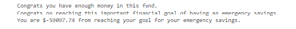
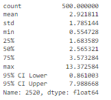

# Financial_Planning_Tool
This is an application utilizing Monte Carlo simulations to create a financial planner for emergencies and retirement. It provides up to date information using Free Crypto API and Alpaca API.

---

## Technologies

This project leverages python 3.7 with the following packages:

* [pandas] (https://github.com/pandas-dev/pandas) - For cleaning and filtering the data.

* [mathplotlib] (https://github.com/ipython/matplotlib-inline) - For visualizing data sets.

* [requests] (https://github.com/psf/requests) - For sending HTTP/1.1 requests easily.

* [json] (https://github.com/nlohmann/json) - For organizing data from API requests.

* [alpaca_trade] (https://github.com/alpacahq/alpaca-trade-api-python) - For API access to Alpaca.

* [MCForecastTools] (https://pypi.org/project/forecast-tools/) - For utilizing Monte Carlo simulation.

* [dotenv] (https://github.com/motdotla/dotenv) - For loading environment variables for .env files.

* [os] (https://docs.python.org/3/library/os.html) - For miscellaneous operating system interfaces.

---

## Datasets/APIs

Datasets pulled from * [Free Crypto API] (https://alternative.me/crypto/api/) and [Alpaca API] (https://alpaca.markets/)

## Usage

### General

Upon launching the financial_planning_tools.ipynb run each cell sequentially. You will need to create your own .env file storing your unique Alpaca API Key and Secret Key. For data pulled from the Alpaca API you will need to change the start/end date arguments to the most recent business day - so that the information you are pulling is up to date.

### Financial Planner for Emergencies

This application will return whether or not you have enough money in the portfolio to cover your emergency fund. It will return three different responses based on the amount in your portfolio compared to your emergency fund goal.

Here is an example of the three responses:

### Financial Planner for Retirement

This application will run and analyze two different morte carlo simulations projecting a portfolio with different weights 30 years and 10 years into the future. 

Here is an example of the MC simulation visualized on a line plot.

Here is an example of the MC simulation plotted as a histogram to visualize the distribution.

Summary stats will be created so that futher analysis can be done. Here is an example sumary table.

Then the application give us a prediction for the future value of the portfolio within a 95% confidence interval.